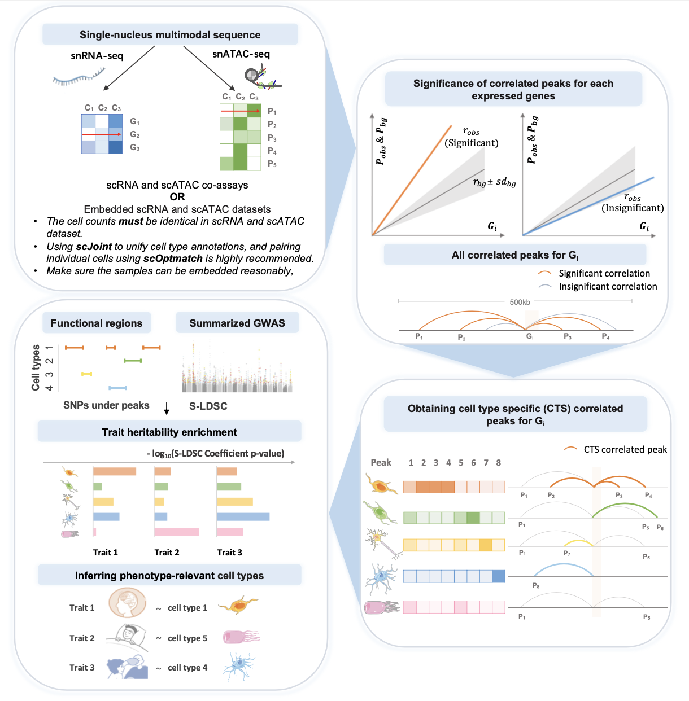

# Fi-Cell

- **F**unctional **i**nference of phenotype **C**ritical c**ell**
- in a functional perspective with high **Fi**delity

## **Overview**

<p align="center">
    
</p>


## **Installation**

Fi-Cell can be downloaded by cloning this repository via the commands:

```shell
git clone https://github.com/LockenLiu/Fi-Cell.git
cd Fi-Cell 
```

## **Prerequisites**

##### Anaconda or Miniconda distribution

In order to void any issues with software versioning, Fi-Cell utilises conda environments to automatically install all necessary dependencies. If conda is not present on your system, please install [anaconda](https://www.anaconda.com) or [miniconda](https://docs.conda.io/en/latest/miniconda.html) following the official instructions.

##### Once conda is ready, users can create an environment to install dependencies that Fi-Cell needs through the following commands:

```shell
conda install -c conda-forge mamba
mamba env create --file envs/FiCell.yaml
conda activate FiCell
```

##### Fi-Cell integrates [FigR](https://github.com/buenrostrolab/FigR) and [ldsc](https://github.com/bulik/ldsc), please install them before running Fi-Cell.

```R
devtools::install_github("buenrostrolab/FigR")
BiocManager::install("BSgenome.Hsapiens.UCSC.hg38")
```

```shell
cd your/dir/to/Fi-Cell
git clone https://github.com/bulik/ldsc.git
cd ldsc
conda activate
conda env create --file environment.yml
```
##### Data in directories `Fi-Cell/data` and `Fi-Cell/example` are deposited on [`Google Cloud platform`](https://console.cloud.google.com/storage/browser/ficell), please make them ready before running.
Website link: [https://console.cloud.google.com/storage/browser/ficell](https://console.cloud.google.com/storage/browser/ficell)

## **Getting Started** 

**Quick Run Fi-Cell**

The following command will quickly run our example.

```shell
conda activate FiCell
snakemake --use-conda --snakefile Fi-Cell.snakefile --configfile config.yml -j
```

We recommend running with `-j` as it will use all available cores. Specifying `-j 4` will use up to 4 cores. 


** Step 1: Integrated scRNA and scATAC data **

For each cell type, Fi-Cell takes scRNA and scATAC datasets with identical cell counts as input. 

scRNA data:

|          | Cell 1 | Cell 2 | Cell 3 | ...  | Cell 256 |
| :------: | :----: | :----: | :----: | :--: | :------: |
|  Gene 1  |   0    |   1    |   0    | ...  |    2     |
|  Gene 2  |   0    |   0    |   0    | ...  |    3     |
|  Gene 3  |   1    |   0    |   0    | ...  |    2     |
|    …     |   …    |   …    |   …    |  …   |    …     |
| Gene 160 |   2    |   0    |   0    | ...  |    4     |

scATAC data:

|          | Cell 1 | Cell 2 | Cell 3 | ...  | Cell 256 |
| :------: | :----: | :----: | :----: | :--: | :------: |
|  Peak 1  |   2    |   4    |   0    | ...  |    1     |
|  Peak 2  |   1    |   5    |   0    | ...  |    2     |
|  Peak 3  |   1    |   1    |   0    | ...  |    0     |
|    …     |   …    |   …    |   …    |  …   |    …     |
| Peak 398 |   0    |   2    |   0    | ...  |    1     |

The demanding requirements of Fi-Cell input can be easily satisfied with scRNA and scATAC co-assays. However, if you expect to **apply Fi-Cell to independent scRNA and scATAC datasets, datasets embedding can be pivotal**. Here are some suggestions:

1. Make sure the samples of the scRNA and scATAC data can be reasonably matched. It would be unresonable to match cells from two distinctive tissues, like  brain and kidney. 
2. Cell type annotations can be varied in different datasets, though they were sampled from identical tissues. It's OK to just match cell types with similar names, several methods used to unify cell annotations are more recommended:
   1. `scJoint`: a transfer learning method to integrate atlas-scale, heterogeneous collections of scRNA-seq and scATAC-seq data. [available at: https://github.com/SydneyBioX/scJoint]
   2. `ATACANNOT`: a novel scATAC-seq cell type annotation method using scRNA-seq data as the reference. [available at: https://github.com/TianLab-Bioinfo/AtacAnnoR]
3. After collecting scRNA and scATAC datasets with unified cell annotations, however, the cell counts are not identical in the two matrix, and cellular individuals are not matched. Once again, it's OK to randomly match cellular individuals (randomly sampling cells to meet identical cell counts), however, strategies like `scOptmatch` can be used to match cell individual optimally. 
   1. `scOptmatch`:  enabling approximately one-to-one pairing of cells of similar annotations between assays [available at:https://github.com/buenrostrolab/FigR/blob/HEAD/R/cellPairing.R]

* *Though Fi-Cell can work well on embedded datasets, we still more encourage multi-modal dataset for more anthentic and robust significances.* 

**Step 2: GWAS Summary Statistics File**

An  explanation of summary statistics file format is at https://github.com/bulik/ldsc/wiki/Summary-Statistics-File-Format.

an example: 
```shell
conda activate ldsc
python /your/path/to/Fi-Cell/ldsc/munge_sumstats.py \
		--sumstats /your/input/gwas/BMI.txt \
		--a1 A1 \
		--a2 A2 \
		--merge-alleles /your/path/to/Fi-Cell/data/ldsc/w_hm3.snplist \
		--keep-pval \
		--p P \
		--out /your/path/to/Fi-Cell/example/gwas_sumstat/BMI
```

**Step 3: Run Fi-Cell**

Now you have everything Fi-Cell needs, then you can run the analysis workflow under your installation directory by:

```shell
conda activate FiCell
snakemake --use-conda --snakefile Fi-Cell.snakefile --configfile config.yml -j
```

We recommend running with `-j` as it will use all available cores. Specifying `-j 4` will use up to 4 cores. 

**Step 4: Inspect the output**

An output directory of Fi-Cell  is shown:

```
<your Fi-Cell output dir>/
├── precomputaion/
│   ├── cisCor 
│   ├── SNPs
│   ├── bed
│   ├── Allcell-ldscore
│   └── ldscore
└── res/
```

* `precomputation/cisCor/`: peak-gene connections
  * `[celltype].cisCor.tsv`: All peak-gene connections
  * `[celltype].cisCor.snpped.tsv`: All peak-gene connections with HapMap3 SNPs under peak
  * `[celltype].cisCorfilt.pval5e-2.tsv`: Significantly correlated peak-gene connections with HapMap3 SNPs under peak
  * `[celltype].cisCorfilt.pval5e-2.cts.tsv`: Cell type-specific significantly correlated peak-gene connections with HapMap3 SNPs under peak
* `precomputation/SNPs/`: hapmap3 SNPs uner peaks of cisCor
* `precomputation/bed/`: bed files of SNPs, used to construct the annotation
* `precomputation/Allcell-ldscore/`: merged cell type genomic annotations of all cell types
* `precomputation/ldscore/`: splitted cell type genomic annotations of our primary analyses (including .annot and .ldscore files)
* `res/`: S-LDSC results

## **Contributors**

Jun-Hui Liu (Xi’an Jiaotong University, China)

Ruo-Han Hao (Xi’an Jiaotong University, China)
